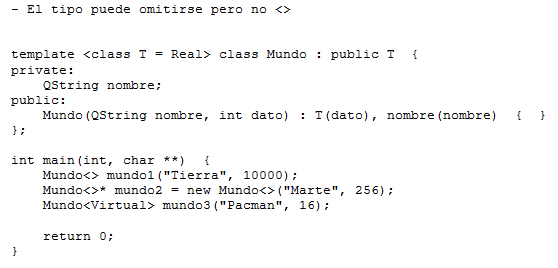
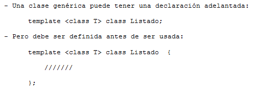
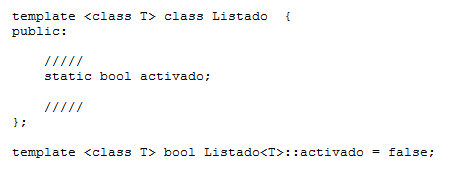

.. -*- coding: utf-8 -*-

.. _rcs_subversion:

Clase 07 - PGE 2020
===================
(Fecha: 15 de septiembre)

Para Opcionables y Mini Examen
==============================

:Tarea para Clase 8:
	Completar y estudiar exhaustivamente la clase Listado

	Estudiar sobrecarga de operadores y templates

	Ver `Tutorial Qt QVector <https://www.youtube.com/watch?v=Z9u2yDPh57U>`_ de `Videos tutoriales de Qt <https://www.youtube.com/playlist?list=PL54fdmMKYUJvn4dAvziRopztp47tBRNum>`_

	Ver `Tutorial Qt QList <https://www.youtube.com/watch?v=xx5wIjUwlg8>`_ de `Videos tutoriales de Qt <https://www.youtube.com/playlist?list=PL54fdmMKYUJvn4dAvziRopztp47tBRNum>`_

	Ver `Tutorial C++ vector <https://www.youtube.com/watch?v=dNb468_AJQI>`_ de `Videos tutoriales de C++ <https://www.youtube.com/playlist?list=PL54fdmMKYUJvS32aLptKVC0AH9bwsavzi>`_

**Clase genérica con argumento por defecto**

**Declaración adelantada**

**Miembros estáticos**

Ejercicio 8:
==========

- Definir la clase ``LineaDeTexto`` que herede de ``QLineEdit``
- Sobrecargar el ``operator+`` ``operator=`` y el constructor copia para que se puede ejecutar la siguiente línea de código:
	
.. code-block:: c
	
	linea = linea1 + linea2;  
	// Los tres son objetos LineaDeTexto y la suma devuelve un LineaDeTexto con los textos concatenados
	

Ejercicio 9:
============

- Haga funcionar la siguiente función ``main()``

.. code-block:: c
	
	#include <QApplication>
	#include "lineadetexto.h"

	int main( int argc, char ** argv )  {
	    QApplication a( argc, argv );

	    LineaDeTexto linea;

	    {
	        LineaDeTexto l1 = "Hola";
	        LineaDeTexto l2 = "che";

	        linea = l1 + l2;
	    }

	    linea.show();  // Esta línea mostrará un QLineEdit con el texto 'Hola che'

	    return a.exec();
	}

Ejercicio 10:
============

- Incorporar LineaDeTexto a un proyecto de Qt para promocionarlo en QtDesigner
- Crear un Formulario con QtDesigner que tenga 4 LineaDeTexto promocionadas
- El formulario será para alta de personas
- Un campo para Nombre, otro para Apellido, para DNI y uno para Nombre completo.
- Esta última LineaDeTexto concatenará en tiempo real el nombre y apellido usando el operator+ de LineaDeTexto
