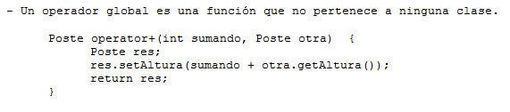

.. -*- coding: utf-8 -*-

.. _rcs_subversion:

Clase 13 - PGE 2021
===================
(Fecha: 23 de septiembre)

**Clase genérica con argumento por defecto**

.. figure:: images/clase03/por_defecto.png

**Declaración adelantada**

.. figure:: images/clase03/declaracion_adelantada.png

**Miembros estáticos**

.. figure:: images/clase03/miembros_estaticos.png

**Sobrecarga de operadores globales**

Ejercicio
=========

- Utilizar la clase Poste para sobrecargar operator+ para que sume un objeto Poste con un int.

- Esa sobrecarga nos permitirá hacer Poste suma = p1 + 5;

- Qué pasa si queremos		 Poste suma = 5 + p1;
- Debemos hacerlo sobrecargando el operador global.

Ejercicio
=========

- Haga funcionar la siguiente función ``main()``

.. code-block:: c
	
	#include <QApplication>
	#include "lineadetexto.h"

	int main( int argc, char ** argv )  {
	    QApplication a( argc, argv );

	    LineaDeTexto linea;

	    {
	        LineaDeTexto l1 = "Hola";
	        LineaDeTexto l2 = "che";

	        linea = l1 + l2;
	    }

	    linea.show();  // Esta línea mostrará un QLineEdit con el texto 'Hola che'

	    return a.exec();
	}

Captura de eventos con eventFilter
==================================

- En un QWidget dibujar una imagen de 50x50.
- Con un QTimer hacer rotar la imagen cada 20 mseg.
- Permitir desplazar la imagen con las teclas y usando eventFilter.
- Utilizar los métodos rotate y translate de QPainter.

.. code-block::

	#include <QWidget>

	class QTimer;
	class QImage;

	namespace Ui  {
	    class Principal;
	}

	class Principal : public QWidget  {
	    Q_OBJECT

	public:
	    explicit Principal( QWidget * parent = 0 );
	    ~Principal();

	private:
	    Ui::Principal *ui;
	    QTimer* timer;
	    int rotacion, transX, transY;
	    QImage * image;

	protected:
	    void paintEvent( QPaintEvent * e );
	    bool eventFilter( QObject *, QEvent * );

	private slots:
	    void slot_ciclos();
	};

	#include "principal.h"
	#include "ui_principal.h"
	#include <QTimer>
	#include <QPainter>
	#include <QKeyEvent>
	#include <QImage>

	Principal::Principal( QWidget * parent ) : QWidget( parent ), 
	                                           ui( new Ui::Principal ),
	                                           rotacion( 0 ), 
	                                           transX( 0 ), 
	                                           transY( 0 )
	{
	    ui->setupUi( this );
	    this->installEventFilter( this );
	    image = new QImage( ":/User.png" );
	    timer = new QTimer;
	    timer->setInterval( 20 );
	    connect( timer, SIGNAL( timeout() ), SLOT( slot_ciclos() ) );
	    timer->start();
	}

	Principal::~Principal()  {
	    delete ui;
	}

	void Principal::paintEvent( QPaintEvent * e )  {
	    QPainter* p = new QPainter( this );
	    p->translate( this->width() / 2 + transX, this->height() / 2 + transY );
	    p->rotate( 10*++rotacion );
	    p->drawImage( 0, 0, *image );
	    if ( rotacion >= 360 )
	        rotacion = 0;
	}

	void Principal::slot_ciclos()  {
	    this->repaint();
	}

	bool Principal::eventFilter( QObject * obj, QEvent * e )  {
	    if ( obj == this )  {
	        if ( e->type() == QEvent::KeyPress )  {
	            int key = static_cast< QKeyEvent * >( e )->key();

	            switch( key )  {

	            case Qt::Key_Up:
	                transY -= 10;
	                break;
	            case Qt::Key_Down:
	                transY += 10;
	                break;
	            case Qt::Key_Left:
	                transX -= 10;
	                break;
	            case Qt::Key_Right:
	                transX += 10;
	                break;
	            case Qt::Key_Escape:
	                this->close();
	                break;
	            }

	            // Devolvemos true para indicar que este evento ya lo controlamos aquí
	            // y no es necesario que se propague para que alguien más lo controle.
	            return true;  
	        }
	    }

	    // Esto es para que la clase base decida si necesita controlar los eventos
	    // que no estamos capturando nosotros.
	    return QWidget::eventFilter( obj, e );
	}

Clase QCompleter
================

- Permite completar palabras que está escribiendo el usuario en un QLineEdit
- Se basa en un listado de palabras:

.. code-block::

	QCompleter( const QStringList & list, QObject * parente = nullptr );

.. code-block::

	QStringList lista;
	lista << "Jorge << "Miguel" << "Marcos" << "Luis";

	QCompleter * completer = new QCompleter( lista, this );
	completer->setCaseSensitivity( Qt::CaseInsensitive );
	ui->leUsuario->setCompleter( completer );

