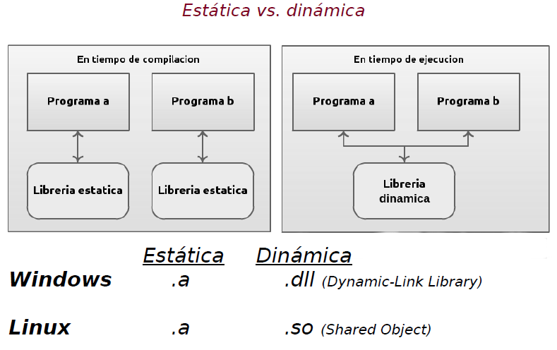

.. -*- coding: utf-8 -*-

.. _rcs_subversion:

Clase 14 - PGE 2021
===================
(Fecha: 28 de septiembre)

Clase QCompleter
================

- Permite completar palabras que está escribiendo el usuario en un QLineEdit
- Se basa en un listado de palabras:

.. code-block::

	QCompleter( const QStringList & list, QObject * parente = nullptr );

.. code-block::

	QStringList lista;
	lista << "Jorge << "Miguel" << "Marcos" << "Luis";

	QCompleter * completer = new QCompleter( lista, this );
	completer->setCaseSensitivity( Qt::CaseInsensitive );
	ui->leUsuario->setCompleter( completer );

Creación y uso de librerías dinámicas
=====================================

.. figure:: images/clase14_librerias01.png

.. figure:: images/clase14_librerias02.png

.. figure:: images/clase14_librerias03.png

Ejercicio
=========

- Definir una clase genérica ``MiVector`` que herede de ``QVector< T >`` y que permita ordenar de menor a mayor cualquier elemento.
- Considere que para ordenar de menor a mayor algún elemento se necesitará comparar un elemento con otro.
- Por lo tanto, si deseamos que ``MiVector`` pueda contener elementos de cualquier tipo, y además deseamos ordenarlos, entonces estos elementos deberan cumplir la caraccterística de ser "comparables". Esto es muy familiar cuando se trabaja en Java.
- Definir clases comparables eligiendo la/las característica/s que permitan comparar dichos objetos entre ellos.
- Entre las clases que se pueden definir como comparables están: ``Persona``, ``Poste``, ``Cliente``, ...
- Probar el funcionamiento del ordenamiento utilizando ``MiVector< Persona >``, ``MiVector< Poste >``, ``MiVector< int >``.
- Mostrar los resultados en un ``QTextEdit`` en lugar de visualizarlo directamente por consola.
- ¿Qué pasaría con el ordenamiento si se utilizan punteros como elementos, por ejemplo, ``MiVector< Persona * >``, ``MiVector< Poste * >``.

Entregable Clase 14
===================

- Punto de partida: Empty project.
- Resolver el ejercicio anterior.
- Entrar al siguiente `link para ver el registro de los entregables <https://docs.google.com/spreadsheets/d/1xbj6brqzdn3R9sfjDEP0LEjg6CwMNMOb8dBEYGmxhTw/edit?usp=sharing>`_ 
- El link de Youtube se comparte con el docente por mensaje privado de Teams.
- En caso de requerir más tiempo para la entrega, escribir por WhatsApp al docente antes de medianoche.

