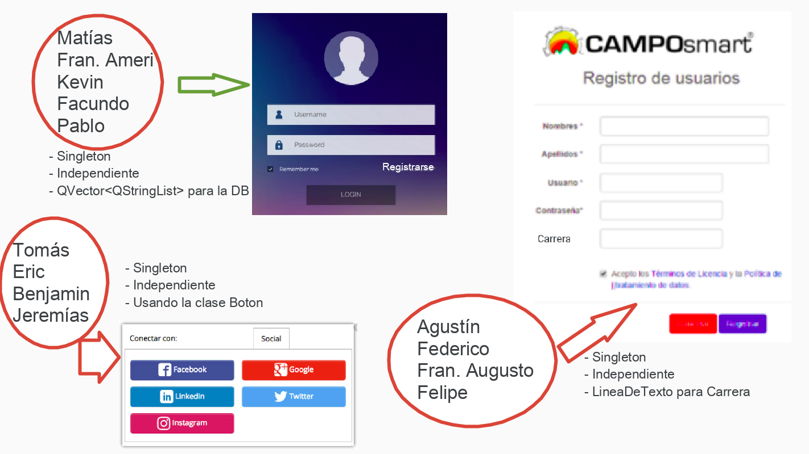

.. -*- coding: utf-8 -*-

.. _rcs_subversion:

Clase 15 - PGE 2020
===================
(Fecha: 15 de octubre)

Ejercicio 24:
============

- Definir estas clases independientes para luego controlarlas a través de un Manager

