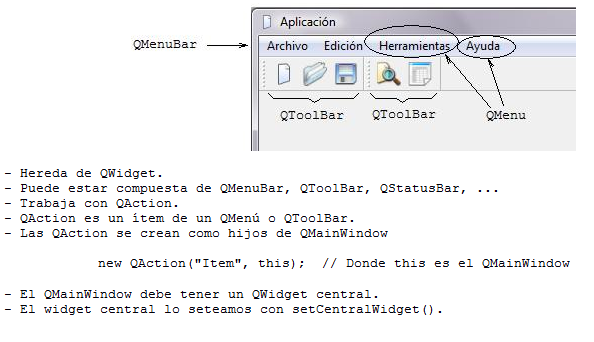
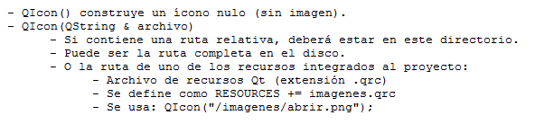

.. -*- coding: utf-8 -*-

.. _rcs_subversion:

Clase 17 - PGE 2021
===================
(Fecha: 12 de octubre)

QMainWindow
===========

**QAction**

.. figure:: images/clase17_qaction.png

**QIcon**

:Buscar íconos aquí: http://findicons.com/

Uso de una clase propia con QtDesigner
======================================

- Deben heredar de algún QWidget
- Colocamos el widget (clase base) con QtDesigner
- Clic derecho "Promote to"

.. figure:: images/clase17_qtdesigner.png
                     
- Base class name: QLabel
- Promoted class name: MiLabel
- Header file: miLabel.h
- Add (y con esto queda disponible para promover)

- La clase MiLabel deberá heredar de QLabel
- El constructor debe tener como parámetro:

.. code-block:: c++

    MiLabel( QWidget * parent = 0 );  // Esto en miLabel.h

    MiLabel::MiLabel( QWidget * parent ) : QLabel( parent )  {  // Esto en miLabel.cpp
    
    }

Videos complementarios sobre QMainWindow
========================================

* `Explicación de QMainWindow - https://youtu.be/ldxQrBTjio0 <https://youtu.be/ldxQrBTjio0>`_

* `Creación de una interfaz con QMainWindow - https://youtu.be/fNS2Wyf-PaY <https://youtu.be/fNS2Wyf-PaY>`_

Entregable Clase 17
===================

- Punto de partida: Qt Widgets Application con QMainWindow
- Crear un editor de código fuente (como el NotePad++ o el Sublime Text).
- Utilice un buen paquete de íconos.
- Que tenga las funcionalidades más comunes de los editores de texto.
- Entrar al siguiente `link para ver el registro de los entregables <https://docs.google.com/spreadsheets/d/1xbj6brqzdn3R9sfjDEP0LEjg6CwMNMOb8dBEYGmxhTw/edit?usp=sharing>`_ 
- El link de Youtube se comparte con el docente por mensaje privado de Teams.
- En caso de requerir más tiempo para la entrega, escribir por WhatsApp al docente antes de medianoche.

