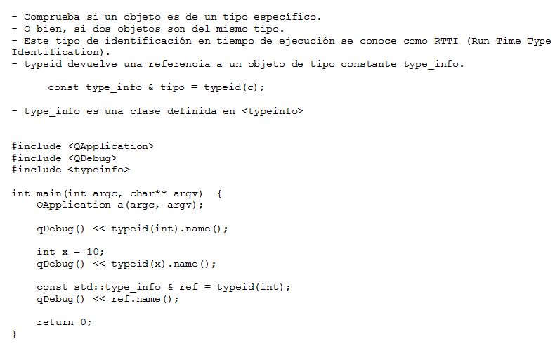
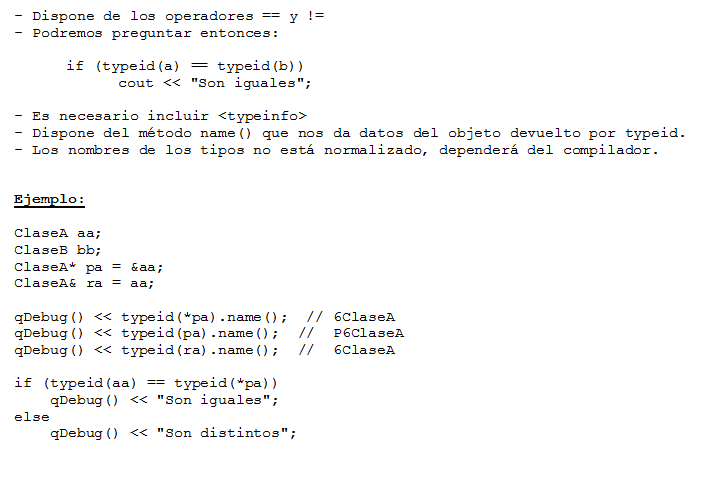
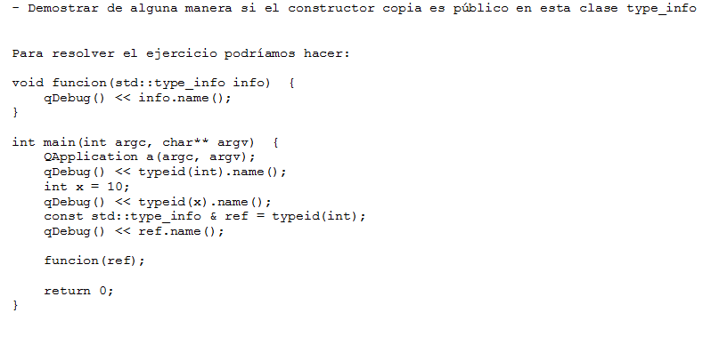

.. -*- coding: utf-8 -*-

.. _rcs_subversion:

Clase 19 - PGE 2020
===================
(Fecha: 5 de noviembre)

typeid
======

**Clase type_info**

- Dispone de un método para preguntar si es puntero y otro método para saber si es puntero a función:
		    
.. code-block::
			
	virtual bool __is_pointer_p() const;
   
	virtual bool __is_function_p() const;

Ejercicio 25:
============

Ejercicio 26:
============

.. figure:: images/clase09/ejercicio2.png

**Uso de dynamic_cast. Uso de typeid**

.. code-block:: c++

	#ifndef PERSONA_H
	#define PERSONA_H

	#include <QString>

	class Persona  {
	public:
	    Persona() : dni( 0 )  {  }
	    virtual ~Persona()  {  }

	private:
	    int dni;
	};

	class Cliente : public Persona  {
	public:
	    Cliente() : cuenta( 0 ), tipo( "Corriente" )  {  }

	private:
	    int cuenta;
	    QString tipo;
	};

	class Empleado : public Persona  {
	public:
	    Empleado() : sueldo( 0 )  {  }

	private:
	    int sueldo;
	};

	#endif // PERSONA_H

.. code-block:: c++

	#ifndef PRINCIPAL_H
	#define PRINCIPAL_H

	#include <QWidget>
	#include <QVector>
	#include "persona.h"

	namespace Ui {
	    class Principal;
	}

	class Principal : public QWidget
	{
	Q_OBJECT

	public:
	    explicit Principal( QWidget * parent = nullptr );
	    ~Principal();

	private:
	    Ui::Principal * ui;
	    QVector< Persona * > vector;

	private slots:
	    void slot_agregar();
	};

	#endif // PRINCIPAL_H

.. code-block:: c++

	#include "principal.h"
	#include "ui_principal.h"
	#include <QDebug>

	Principal::Principal( QWidget * parent ) : QWidget( parent ),
	                                           ui( new Ui::Principal )  {
	    ui->setupUi( this );

	    connect( ui->pbCliente, SIGNAL( pressed() ), this, SLOT( slot_agregar() ) );
	    connect( ui->pbEmpleado, SIGNAL( pressed() ), this, SLOT( slot_agregar() ) );
	}

	Principal::~Principal()  {
	    delete ui;
	}

	void Principal::slot_agregar()  {

	    if ( this->sender() == ui->pbCliente )  {
	        if (vector.isEmpty())  {
	            vector.push_back( new Cliente );
	            qDebug() << "Se agrega como primer elemento un Cliente";
	        }
	        else  {
	            Cliente * pd = dynamic_cast< Cliente * >( vector.at( 0 ) );

	            if ( pd != 0 )  {
	                vector.push_back( new Cliente );
	                qDebug() << "Se agrega otro Cliente. El Cliente numero" << vector.size();
	            }
	            else  {
	                qDebug() << "Este QVector no contiene Clientes. No se agrega nada.";
	            }
	        }
	    }
	    else  {
	        if ( vector.isEmpty() )  {
	            vector.push_back( new Empleado );
	            qDebug() << "Se agrega como primer elemento un Empleado";
	        }
	        else  {
	            Empleado * pd = dynamic_cast<Empleado*>( vector.at( 0 ) );

	            if ( pd != 0 )  {
	                vector.push_back( new Empleado );
	                qDebug() << "Se agrega otro Cliente. El Empleado numero" << vector.size();
	            }
	            else  {
	                qDebug() << "Este QVector no contiene Empleados. No se agrega nada.";
	            }
	        }
	    }
	}

Ejercicio 31:
============

- Hacer lo mismo pero usando typeid.

Clase QThread
============

- Permite crear hilos de ejecución para realizar varias tareas a la vez. 
- Proporciona el método start() para iniciar el hilo.
- Emite señales para indicar el inicio y fin de la ejecución del hilo.
- Se necesita reimplementar el método run() en una clase derivada de QThread.
- El código dentro de run() se ejecuta en un hilo y finaliza cuando retorna.
- La programación multihilo es útil para realizar tareas que consumen tiempo sin congelar la interfaz de usuario.

.. code-block:: c++

	class MiHilo : public QThread  {
	    Q_OBJECT

	protected:
	    void run();
	};

	void MiHIlo::run()  {

	    ...

	}

	
- Las clases no GUI (QTimer, QTcpSocket, QFtp, etc.) fueron diseñadas para funcionar en un hilo independiente.
- Las clases GUI (QWidget y derivadas) sólo se puede usar desde el hilo principal.
- Para consultar el estado del hilo podemos utilizar isFinished() o isRunning().
- Podríamos terminar un hilo a fuerza bruta con terminate().
- Dormimos el hilo con: sleep(int seg) o msleep(int miliseg) o usleep(int microseg)

**Ejemplo: Clase Factorial**

.. figure:: images/clase19/clase_factorial.png

Ejercicio 27:
============
	
- Diseñar una aplicación GUI que escriba en un archivo muchísimos caracteres de tal forma se note que la interfaz de usuario se bloquea hasta finalizar la escritura.
- Luego de esto, utilizar un hilo distinto para escribir la misma cantidad de caracteres.

Ejercicio 28:
============

.. figure:: images/clase16/ejer-medidor.jpg

Ejemplo de App Android
======================

