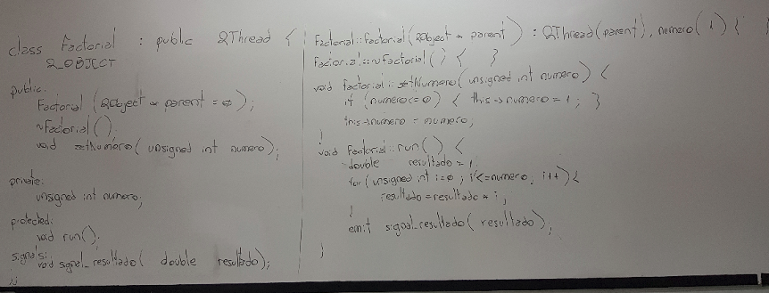
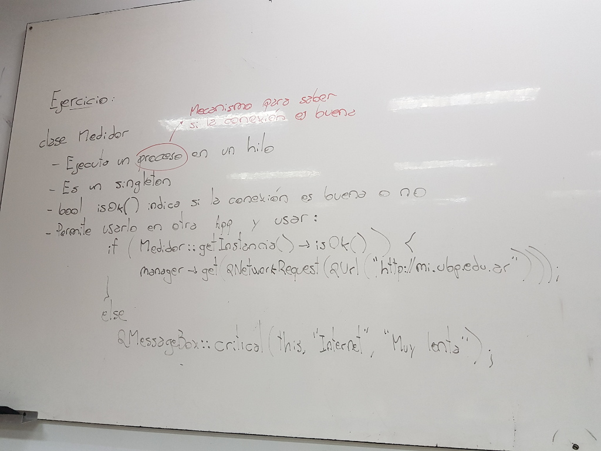

.. -*- coding: utf-8 -*-

.. _rcs_subversion:

Clase 21 - PGE 2021
===================
(Fecha: 26 de octubre)

typeid
======

- Comprueba si un objeto es de un tipo específico.
- O bien, si dos objetos son del mismo tipo.
- Este tipo de identificador en tiempo de ejecución se conoce como RTTI (Run-Time Type Identification).
- typiid devuelve una referencia a un objeto de tipo const type_info.

.. code-block:: c++

	#include <QApplication>
	#include <QDebug>
	#include <typeinfo>

	int main( int argc, char ** argv )  {
	    QApplication a( argc, argv );

	    qDebug() << typeid( int ).name();

	    int x = 10;
	    qDebug() << typeid( x ).name();

	    const std::type_info & ref = typeid( int );
	    qDebug() << ref.name();

	    return 0;
	}

**Clase type_info**

- Dispone de un método para preguntar si es puntero y otro método para saber si es puntero a función:
		    
.. code-block:: c++
			
	virtual bool __is_pointer_p() const;
   
	virtual bool __is_function_p() const;

- Dispone de los operadores ``==`` y ``!=``
- Con os cuales podremos preguntar:

.. code-block:: c++
			
	if ( typeid( a ) == typeid( b ) )
	    cout << "Son iguales";

- Es necesario incluir ``<typeinfo>``
- Dispone del método ``name()`` que nos da datos del objeto devuelto por ``typeid``.
- Los nombres de los tipos no está normalizado, dependerá del compilador.

.. code-block:: c++

	ClaseA aa;
	ClaseB bb;
	ClaseA * pa = &aa;
	
	qDebug() << typeid( *pa ).name();  // 6ClaseA
	qDebug() << typeid( pa ).name();   // P6ClaseA
	qDebug() << typeid( bb ).name();   // 6ClaseB

	if ( typeid( aa ) == typeid( *pa ) )
	    qDebug() << "Son iguales";
	else
	    qDebug() << "Son distintos";

Ejercicio
---------

.. figure:: images/clase21_ejercicio.png

Uso de dynamic_cast. Uso de typeid
==================================

.. code-block:: c++

	#ifndef PERSONA_H
	#define PERSONA_H

	#include <QString>

	class Persona  {
	public:
	    Persona() : dni( 0 )  {  }
	    virtual ~Persona()  {  }

	private:
	    int dni;
	};

	class Cliente : public Persona  {
	public:
	    Cliente() : cuenta( 0 ), tipo( "Corriente" )  {  }

	private:
	    int cuenta;
	    QString tipo;
	};

	class Empleado : public Persona  {
	public:
	    Empleado() : sueldo( 0 )  {  }

	private:
	    int sueldo;
	};

	#endif // PERSONA_H

.. code-block:: c++

	#ifndef PRINCIPAL_H
	#define PRINCIPAL_H

	#include <QWidget>
	#include <QVector>
	#include "persona.h"

	namespace Ui {
	    class Principal;
	}

	class Principal : public QWidget
	{
	Q_OBJECT

	public:
	    explicit Principal( QWidget * parent = nullptr );
	    ~Principal();

	private:
	    Ui::Principal * ui;
	    QVector< Persona * > vector;

	private slots:
	    void slot_agregar();
	};

	#endif // PRINCIPAL_H

.. code-block:: c++

	#include "principal.h"
	#include "ui_principal.h"
	#include <QDebug>

	Principal::Principal( QWidget * parent ) : QWidget( parent ),
	                                           ui( new Ui::Principal )  {
	    ui->setupUi( this );

	    connect( ui->pbCliente, SIGNAL(pressed()), this, SLOT(slot_agregar()) );
	    connect( ui->pbEmpleado, SIGNAL(pressed()), this, SLOT(slot_agregar()) );
	}

	Principal::~Principal()  {
	    delete ui;
	}

	void Principal::slot_agregar()  {

	    if ( this->sender() == ui->pbCliente )  {
	        if ( vector.isEmpty() )  {
	            vector.push_back( new Cliente );
	            qDebug() << "Se agrega como primer elemento un Cliente";
	        }
	        else  {
	            Cliente * pd = dynamic_cast< Cliente * >( vector.at( 0 ) );

	            if ( pd != 0 )  {
	                vector.push_back( new Cliente );
	                qDebug() << "Se agrega otro Cliente. El Cliente numero" << vector.size();
	            }
	            else  {
	                qDebug() << "Este QVector no contiene Clientes. No se agrega nada.";
	            }
	        }
	    }
	    else  {
	        if ( vector.isEmpty() )  {
	            vector.push_back( new Empleado );
	            qDebug() << "Se agrega como primer elemento un Empleado";
	        }
	        else  {
	            Empleado * pd = dynamic_cast< Empleado * >( vector.at( 0 ) );

	            if ( pd != 0 )  {
	                vector.push_back( new Empleado );
	                qDebug() << "Se agrega otro Cliente. El Empleado numero" << vector.size();
	            }
	            else  {
	                qDebug() << "Este QVector no contiene Empleados. No se agrega nada.";
	            }
	        }
	    }
	}

Clase QThread
============

- Permite crear hilos de ejecución para realizar varias tareas a la vez. 
- Proporciona el método start() para iniciar el hilo.
- Emite señales para indicar el inicio y fin de la ejecución del hilo.
- Se necesita reimplementar el método run() en una clase derivada de QThread.
- El código dentro de run() se ejecuta en un hilo y finaliza cuando retorna.
- La programación multihilo es útil para realizar tareas que consumen tiempo sin congelar la interfaz de usuario.

.. code-block:: c++

	class MiHilo : public QThread  {
	    Q_OBJECT

	protected:
	    void run();
	};

	void MiHIlo::run()  {

	    ...

	}

	
- Las clases no GUI (QTimer, QTcpSocket, QFtp, etc.) fueron diseñadas para funcionar en un hilo independiente.
- Las clases GUI (QWidget y derivadas) sólo se puede usar desde el hilo principal.
- Para consultar el estado del hilo podemos utilizar isFinished() o isRunning().
- Podríamos terminar un hilo a fuerza bruta con terminate().
- Dormimos el hilo con: ``sleep(int seg)`` o ``msleep0(int miliseg)`` o ``usleep(int microseg)``

Ejemplo: Clase Factorial
------------------------

Ejercicio:
---------
	
- Diseñar una aplicación GUI que escriba en un archivo muchísimos caracteres de tal forma se note que la interfaz de usuario se bloquea hasta finalizar la escritura.
- Luego de esto, utilizar un hilo distinto para escribir la misma cantidad de caracteres.

Ejercicio
---------

Entregable Clase 21
===================

- Punto de partida: Proyecto vacío.

Opción 1
--------

- Demostrar de alguna manera si type_info tiene el constructor copia público o privado.
- Luego revisar el archivo de cabecera de type_info para corroborar.
- Como ayuda el siguiente código:

.. code-block:: c++

	void funcion( std::type_info info )  {
	    qDebug() << info.name();
	}

	int main( int argc, char ** argv )  {
	    QApplication a( argc, argv );

	    const std::type_info & ref = typeid( int );
        qDebug() << ref.name();

	    return 0;
	}

- Implementar y probar el ejercicio de la clase Factorial.

Opción 2
--------

- Implementar y probar el ejercicio de la clase Medidor.

- Entrar al siguiente `link para ver el registro de los entregables <https://docs.google.com/spreadsheets/d/1xbj6brqzdn3R9sfjDEP0LEjg6CwMNMOb8dBEYGmxhTw/edit?usp=sharing>`_ 
- El link de Youtube se comparte con el docente por mensaje privado de Teams.
- En caso de requerir más tiempo para la entrega, escribir por WhatsApp al docente antes de medianoche.

