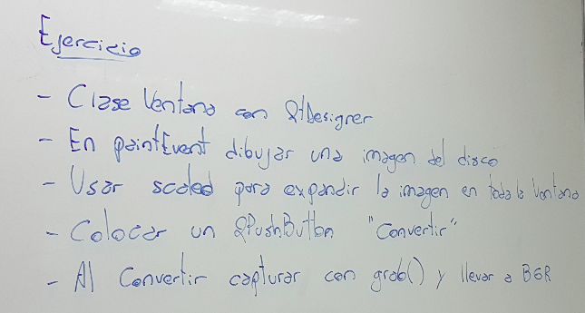
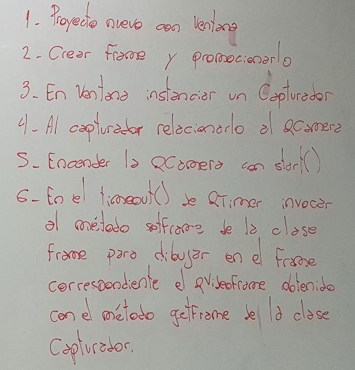

.. -*- coding: utf-8 -*-

.. _rcs_subversion:

Clase 23 - PGE 2021
===================
(Fecha: 4 de noviembre)

Tratamiento de excepciones
^^^^^^^^^^^^^^^^^^^^^^^^^^

.. figure:: images/clase15/excepciones1.png

* `Explicación por un youtuber <http://www.youtube.com/watch?v=wcuknro_V-w>`_

**Excepciones de la biblioteca estándar de C++**

.. figure:: images/clase15/excepciones2.png

**Ejemplo creando nuestras propias clases para excepciones**

.. code-block:: c++

	#ifndef EXCEPCIONES_H
	#define EXCEPCIONES_H

	#include <QString>
	#include <QFile>

	class ExcRango  {
	private:
	    QString mensaje;
	public:
	    ExcRango( QString mensaje, int i ) : mensaje( mensaje )  {   }
	    QString getMensaje()  {  return mensaje;  }
	};

	class ExcNoArchivo  {
	private:
	    QString archivo;
	    QString mensaje;

	public:
	    ExcNoArchivo( QString archivo ) : archivo( archivo )  {
	        QFile file( archivo );
	        if ( ! file.exists() )
	            mensaje.operator=( "El archivo " + archivo + " no existe." );
	    }

	    QString getMensaje()  {  return mensaje;  }
	};

	#endif // EXCEPCIONES_H

.. code-block:: c++

	#ifndef ARCHIVADOR_H
	#define ARCHIVADOR_H

	#include <QFile>
	#include <QTextStream>
	#include "excepciones.h"

	class Archivador  {
	private:
	    static QFile *file;

	public:
	    static bool abrir( QString ruta )  {
	        file->setFileName( ruta );

	        if ( ! file->exists() )  {
	            throw ExcNoArchivo( ruta );
	            return false;
	        }

	        return file->open( QIODevice::Append | QIODevice::Text );
	    } 

	    static bool almacenar( QString texto )  {
	        if ( ! file->isOpen() )
	        return false;

	        QTextStream salida( file );
	        salida << texto;
 
	        return true;
	    }
	};

	QFile * Archivador::file = new QFile( "./defecto.txt" );

	#endif // ARCHIVADOR_H

.. code-block:: c++

	#include <QApplication>
	#include "archivador.h"
	#include <QDebug>

	int main( int argc, char ** argv )  {
	    QApplication a( argc, argv );

	    try  {
	        Archivador::abrir( "./defecto.txt" );
	        Archivador::almacenar( "11111111" );
	    }
	    catch( ExcNoArchivo e )  {
	        qDebug() << e.getMensaje();
	    }

	    return 0;
	}
	
Ejercicio:
==========

- Modificar la clase listado para que cuando sea necesario lance la excepción ExcRango cuando se intente acceder a un index fuera de rango. Probarlo luego en la función main.

.. code-block:: c++

	template < class T > class Listado  {
	private:
	    int cantidad;
	    int libre;
	    T * v;

	public:
	    Listado( int n = 10 ) : cantidad( n ), libre( 0 ), v( new T[ n ] )  {  }
	    bool add( T nuevo );

	    T get( int i )  {
	        if ( i >= libre )
	            throw ExcRango( "Listado fuera de rango", i );
	        return v[ i ];
	    }

	    int length()  {  return libre;  }
	};

	template < class T > bool Listado< T >::add( T nuevo )  {
	    if ( libre < cantidad )  {
	        v[ libre ] = nuevo;
	        libre++;
	        return true;
	    }
	    return false;
	}

Ejercicio:
==========

- Utilizar la siguiente clase Vector (sin modificarla) y, según lo visto en clase, mostrar la manera de averiguar la cantidad de elementos que tiene utilizando excepciones.

.. code-block:: c++

	// Este es el archivo vector.h

	#ifndef VECTOR_H_
	#define VECTOR_H_

	#include <QVector>
	#include <stdexcept>
	#include <string>

	template< class T > class Vector : private QVector< T >  {
	public:
	    const T get( int i )  {
	        if ( i >= this->size() || i < 0 )  {
	            std::string mensaje = "Le pagaste fuera";
	            std::out_of_range e( mensaje );
	            throw e;
	        }

	        return this->at( i );	        
	    }

	    void add( T nuevo )  {
	        this->push_back( nuevo );
	    }
	};

	#endif

Utilización de cámaras de video con Qt
======================================

- Clase QCamera: Controlador de las cámaras
- Clase QCameraViewfinder: Es un QWidget visualizador de imágenes de la cámara
- Clase QCameraInfo: Listado de las cámaras disponibles y la info de cada una
- Requiere en el .pro: QT += multimedia multimediawidgets #Qt5.3 mínimo

**Publicar la descripción de las cámaras disponibles**

.. code-block::

	QList< QCameraInfo > cameras = QCameraInfo::availableCameras();
	for ( int i = 0 ; i < cameras.size() ; i++ )  
	    qDebug() << cameras.at( i ).description();

**Instanciar QCamera y mostrar los frames sobre el QCameraViewfinder**

.. code-block:: c++

    QCameraInfo cameraInfo = cameras.at( 0 );
    QCamera * camera = new QCamera( cameraInfo );

    QCameraViewfinder * visor = new QCameraViewfinder;

    camera->setViewfinder( visor );
    camera->start();

    visor->show();

**Creación de un visor promovido a QWidget para QtDesigner**

.. code-block:: c++

	// Puede estar sólo en el .h (en visor.h)
	#ifndef VISOR_H
	#define VISOR_H

	#include <QCameraViewfinder>

	class Visor : public QCameraViewfinder  {
	    Q_OBJECT
	public:
	    explicit Visor( QWidget * parent = 0 ) : QCameraViewfinder( parent )  {   }
	};

	#endif // VISOR_H

Ejercicio:
==========

- Crear una aplicación con un QCameraViewfinder promovido a QWidget en QtDesigner
- Un botón "Mostrar imagen" para que encienda la cámara y muestre la imagen
- Que complete un QComboBox con las cámaras disponibles
- Un QPushButton para iniciar la cámara seleccionada

Ejercicio:
==========

- Siguiendo el ejercicio anterior, crear una carpeta donde se irán guardando las imágenes de la cámara
- Colocar un QSlider con rango entre 500 y 5000, paso de 500, que indica una cantidad en mili segundos
- Descargar en el disco las imágenes en archivos jpg cada un tiempo según el QSlider anterior
- El nombre del archivo tendrá la fecha y hora en que fue capturada

Ejercicio:
==========

- Siguiendo el ejercicio anterior, usar todas las imágenes de esa carpeta mostrándolas en un QWidget cada 100 mseg.

Análisis píxel a píxel
======================

- **Ejemplo:** Dejar sólo el componente rojo

.. code-block::

    QPixmap pixMap = ui->visor->grab();  // Para llevar el QWidget a QImage
    QImage image = pixMap.toImage();

    for ( int x = 0 ; x < image.width() ; x++ )  {
        for ( int y = 0 ; y < image.height() ; y++ )  {
            QRgb rgb = image.pixel( x, y );  // typedef unsigned int QRgb;
            QRgb nuevoValorRgb = qRgb( qRed( rgb ), 0, 0 );
            image.setPixel( x, y, nuevoValorRgb );
        }
    }

Ejercicio:
==========

- Agregar un QPushButton "Capturar imagen" para procesarla
- Dibujar con paintEvent esa imagen procesada 
- Procesar la imagen con lo siguiente:
	- Invertir los colores rgb a bgr
	- Transformar a escala de grises
		Y = 0.3 R + 0.3 G + 0.3 B // Y en cada componente
	- Convertir al negativo: Cada componente, si lo leemos en binario, debemos invertir cada bit.
		- Ejemplo: R=144=10010000 -> R=01101111

Levantar frame por frame: Clase QAbstractVideoSurface
=====================================================

- QAbstractVideoSurface es una clase abstracta
- Proporciona streaming de video a través de la función virtual pura present()

.. code-block:: c++

	bool QAbstractVideoSurface::present ( const QVideoFrame & frame ) [pure virtual]

**Clase Capturador para obtener los frames de la cámara**

.. code-block:: c++

	class Capturador : public QAbstractVideoSurface  {
	    Q_OBJECT

	public:
	    Capturador( QObject * parent = 0 );

	    QList< QVideoFrame::PixelFormat > supportedPixelFormats(
	          QAbstractVideoBuffer::HandleType handleType = QAbstractVideoBuffer::NoHandle ) const;

	    bool present( const QVideoFrame & frame );

	    QVideoFrame getFrameActual()  {  return frameActual;  }

	private:
	    QVideoFrame frameActual;
	};

- QVideoFrame encapsula los datos de video (bits, ancho, alto, etc.)
- Para acceder a los bits es necesario mapearlo con el método map()
- El mapeo deja en memoria los datos para se accedidos.

.. code-block:: c++

	bool Capturador::present( const QVideoFrame & frame )  {
	    frameActual = frame;
		
	    frameActual.map( QAbstractVideoBuffer::ReadOnly );
		
	    return true;  // Con la idea de devolver true si este frame fue usado
	}

- La función virtual pura supportedPixelFormats() devuelve un listado de formatos soportados.

.. code-block:: c++

	QList< QVideoFrame::PixelFormat > Capturador::supportedPixelFormats(
	                         QAbstractVideoBuffer::HandleType handleType ) const  {
	
	    if ( handleType == QAbstractVideoBuffer::NoHandle ) {
	        return QList< QVideoFrame::PixelFormat >()
	                                                  << QVideoFrame::Format_RGB32
	                                                  << QVideoFrame::Format_ARGB32;
	    }
	    else {
	        return QList< QVideoFrame::PixelFormat >();
	    }
	}

**El constructor**

.. code-block:: c++

	Capturador::Capturador( QObject * parent ) : QAbstractVideoSurface( parent )  {

	}

Ejercicio:
==========

- Usar Capturador para levantar las imágenes de la cámara.
- Convertir a escala de grises y visualizarlo en pantalla.

Ejercicio:
==========

Ejercicio:
==========

.. figure:: images/clase11/ejer3.png

- En esa grilla de 6 celdas, todas esas celdas son objetos Frame.
- 5 de ellos serán imágenes fijas cargadas desde el disco duro.
- La restante serán las imágenes obtenidas en tiempo real desde la cámara.

Ejercicio:
==========

Uso de atributos estáticos
^^^^^^^^^^^^^^^^^^^^^^^^^^

.. code-block:: c++

	// Archivo archivador.h
	#ifndef ARCHIVADOR_H
	#define ARCHIVADOR_H

	#include <QFile>
	#include <QTextStream>

	class Archivador  {
	private:
	    static QFile *file;

	public:
	    static bool abrir( QString ruta );
	    static bool almacenar( QString texto );
	};
	
	#endif // ARCHIVADOR_H

	
.. code-block:: c++

	// Archivo archivador.cpp
	#include "archivador.h"

	QFile * Archivador::file = new QFile("./defecto.txt");

	bool Archivador::abrir( QString ruta )  {
	    file->setFileName( ruta );

	    if ( ! file->exists() )  {
	        return false;
	    }

	    return file->open( QIODevice::Append | QIODevice::Text );
	}

	bool Archivador::almacenar( QString texto )  {
	    if ( ! file->isOpen() )
	        return false;

	    QTextStream salida( file );
	    salida << texto;

	    return true;
	}

Ejercicio:
==========

.. figure:: images/clase13/logger.png

Entregable Clase 22
===================

- Punto de partida: Proyecto vacío y realizar alguno de los ejercicios de esta clase.
- Entrar al siguiente `link para ver el registro de los entregables <https://docs.google.com/spreadsheets/d/1xbj6brqzdn3R9sfjDEP0LEjg6CwMNMOb8dBEYGmxhTw/edit?usp=sharing>`_ 
- El link de Youtube se comparte con el docente por mensaje privado de Teams.
- En caso de requerir más tiempo para la entrega, escribir por WhatsApp al docente antes de medianoche.

