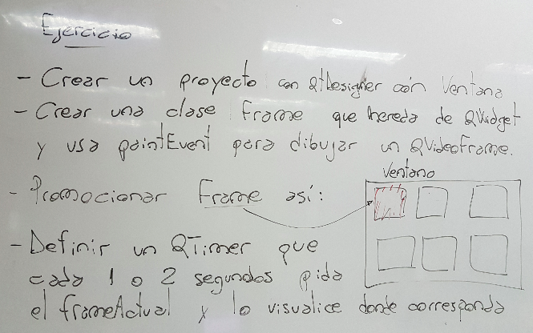
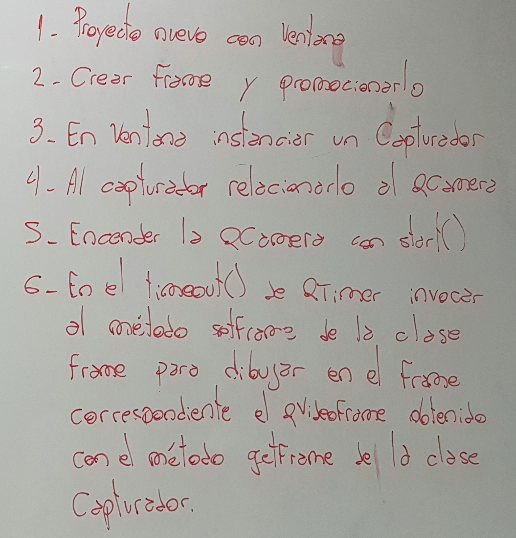
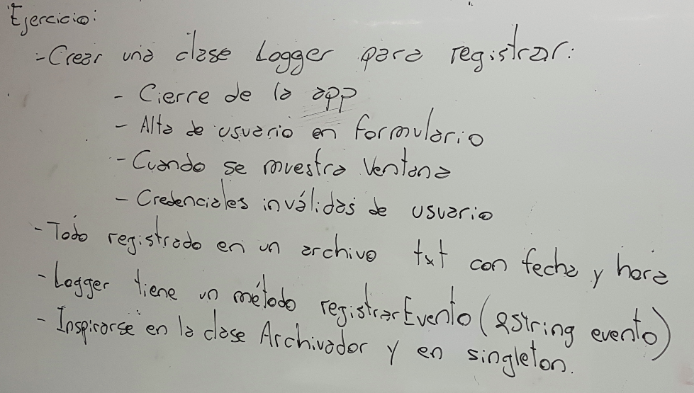

.. -*- coding: utf-8 -*-

.. _rcs_subversion:

Clase 24 - PGE 2021
===================
(Fecha: 11 de noviembre)

Levantar frame por frame: Clase QAbstractVideoSurface
=====================================================

- QAbstractVideoSurface es una clase abstracta
- Proporciona streaming de video a través de la función virtual pura present()

.. code-block:: c++

	bool QAbstractVideoSurface::present ( const QVideoFrame & frame ) [pure virtual]

**Clase Capturador para obtener los frames de la cámara**

.. code-block:: c++

	class Capturador : public QAbstractVideoSurface  {
	    Q_OBJECT

	public:
	    Capturador( QObject * parent = 0 );

	    QList< QVideoFrame::PixelFormat > supportedPixelFormats(
	          QAbstractVideoBuffer::HandleType handleType = QAbstractVideoBuffer::NoHandle ) const;

	    bool present( const QVideoFrame & frame );

	    QVideoFrame getFrameActual()  {  return frameActual;  }

	private:
	    QVideoFrame frameActual;
	};

- QVideoFrame encapsula los datos de video (bits, ancho, alto, etc.)
- Para acceder a los bits es necesario mapearlo con el método map()
- El mapeo deja en memoria los datos para se accedidos.

.. code-block:: c++

	bool Capturador::present( const QVideoFrame & frame )  {
	    frameActual = frame;
		
	    frameActual.map( QAbstractVideoBuffer::ReadOnly );
		
	    return true;  // Con la idea de devolver true si este frame fue usado
	}

- La función virtual pura supportedPixelFormats() devuelve un listado de formatos soportados.

.. code-block:: c++

	QList< QVideoFrame::PixelFormat > Capturador::supportedPixelFormats(
	                         QAbstractVideoBuffer::HandleType handleType ) const  {
	
	    if ( handleType == QAbstractVideoBuffer::NoHandle ) {
	        return QList< QVideoFrame::PixelFormat >()
	                                                  << QVideoFrame::Format_RGB32
	                                                  << QVideoFrame::Format_ARGB32;
	    }
	    else {
	        return QList< QVideoFrame::PixelFormat >();
	    }
	}

**El constructor**

.. code-block:: c++

	Capturador::Capturador( QObject * parent ) : QAbstractVideoSurface( parent )  {

	}

Ejercicio:
==========

- Usar Capturador para levantar las imágenes de la cámara.
- Convertir a escala de grises y visualizarlo en pantalla.

Ejercicio:
==========

.. figure:: images/clase23_ejercicio1.png

Ejercicio:
==========

- En esa grilla de 6 celdas, todas esas celdas son objetos Frame.
- 5 de ellos serán imágenes fijas cargadas desde el disco duro.
- La restante serán las imágenes obtenidas en tiempo real desde la cámara.

Ejercicio:
==========

Uso de atributos estáticos
^^^^^^^^^^^^^^^^^^^^^^^^^^

.. code-block:: c++

	// Archivo archivador.h
	#ifndef ARCHIVADOR_H
	#define ARCHIVADOR_H

	#include <QFile>
	#include <QTextStream>

	class Archivador  {
	private:
	    static QFile *file;

	public:
	    static bool abrir( QString ruta );
	    static bool almacenar( QString texto );
	};
	
	#endif // ARCHIVADOR_H

	
.. code-block:: c++

	// Archivo archivador.cpp
	#include "archivador.h"

	QFile * Archivador::file = new QFile("./defecto.txt");

	bool Archivador::abrir( QString ruta )  {
	    file->setFileName( ruta );

	    if ( ! file->exists() )  {
	        return false;
	    }

	    return file->open( QIODevice::Append | QIODevice::Text );
	}

	bool Archivador::almacenar( QString texto )  {
	    if ( ! file->isOpen() )
	        return false;

	    QTextStream salida( file );
	    salida << texto;

	    return true;
	}

Ejercicio:
==========

Ejercicio:
==========

- Crear una aplicación con un QCameraViewfinder promovido a QWidget en QtDesigner
- Un botón "Mostrar imagen" para que encienda la cámara y muestre la imagen
- Que complete un QComboBox con las cámaras disponibles
- Un QPushButton para iniciar la cámara seleccionada

**Resolución**

- `Código fuente <https://github.com/cosimani/Curso-PGE-2019/blob/master/resources/clase13/camera.zip?raw=true>`_

Entregable Clase 23
===================

- Punto de partida: Proyecto vacío y realizar alguno de los ejercicios de esta clase.
- Entrar al siguiente `link para ver el registro de los entregables <https://docs.google.com/spreadsheets/d/1xbj6brqzdn3R9sfjDEP0LEjg6CwMNMOb8dBEYGmxhTw/edit?usp=sharing>`_ 
- El link de Youtube se comparte con el docente por mensaje privado de Teams.
- En caso de requerir más tiempo para la entrega, escribir por WhatsApp al docente antes de medianoche.

