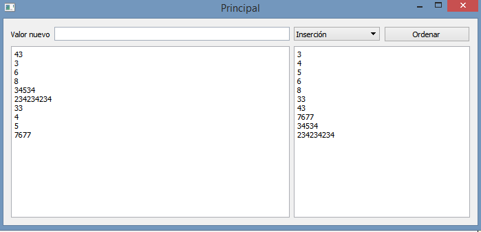
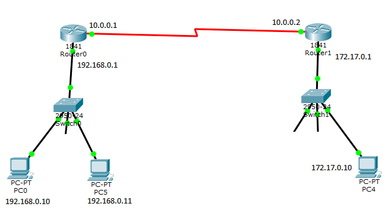

.. -*- coding: utf-8 -*-

.. _rcs_subversion:

Clase 26 - PGE 2015  (Clase no dictada)
===================

**Resolución del Ejercicio con punteros a métodos de la clase Ordenador** 

.. code-block:: c++

	#ifndef ORDENADOR
	#define ORDENADOR

	class Ordenador  {
	public:
	    void burbuja(int * v, int n)  {
	        int i, j, aux;
	        for(i=0 ; i<=n ; i++)  {
	            for(j=0 ; j<n-1 ; j++)  {
	                if(v[j] > v[j+1])  {
	                    aux = v[j];
	                    v[j] = v[j+1];
	                    v[j+1] = aux;
	                }
	            }
	        }
	    }

	    void insercion(int * v, int n)  {
	        int i, j, aux;
	        for (i=1 ; i<n; i++)  {
	            aux = v[i];
	            j = i - 1;
	            while ( (v[j] > aux) && (j >= 0) )  {
	                v[j+1] = v[j];
	                j--;
	            }
	            v[j+1] = aux;
	        }
	    }
	};

	#endif // ORDENADOR
	
.. code-block:: c++

	#ifndef LISTADOENTEROS_H
	#define LISTADOENTEROS_H

	#include <QVector>
	#include "ordenador.h"

	class ListadoEnteros : public QVector<int>  {
	public:

	    void ordenar(void (Ordenador::*pFuncionOrdenamiento)(int *, int))  {
	        (ordenador.*pFuncionOrdenamiento)(this->data(), this->size());
	    }

	private:
	    Ordenador ordenador;
	};

	#endif // LISTADOENTEROS_H
	
.. code-block:: c++

	#ifndef PRINCIPAL_H
	#define PRINCIPAL_H

	#include <QWidget>
	#include "listadoEnteros.h"

	namespace Ui {
	    class Principal;
	}

	class Principal : public QWidget  {
	    Q_OBJECT

	public:
	    explicit Principal(QWidget *parent = 0);
	    ~Principal();

	private:
	    Ui::Principal *ui;
	    ListadoEnteros listado;

	private slots:
	    void slot_ordenar();
	    void slot_valorNuevo();
	};

	#endif // PRINCIPAL_H

.. code-block:: c++

	#include "principal.h"
	#include "ui_principal.h"

	Principal::Principal(QWidget *parent) : QWidget(parent), ui(new Ui::Principal)  {
	    ui->setupUi(this);

	    connect(ui->pbOrdenar, SIGNAL(clicked()), this, SLOT(slot_ordenar()));
	    connect(ui->leValorNuevo, SIGNAL(returnPressed()), this, SLOT(slot_valorNuevo()));
	}

	Principal::~Principal()  {  delete ui;  }

	void Principal::slot_ordenar()  {

	    if (ui->cbMetodo->currentText() == "Burbuja")  {
	        void (Ordenador::*burbuja)(int *, int) = &Ordenador::burbuja;
	        listado.ordenar(burbuja);
	    }
	    else  {
	        void (Ordenador::*insersion)(int *, int) = &Ordenador::insercion;
	        listado.ordenar(insersion);
	    }

	    for (int i=0 ; i<listado.size() ; i++)  {
	        ui->teOrdenados->append(QString::number(listado.at(i)));
	    }
	}

	void Principal::slot_valorNuevo()  {
	    listado.push_back(ui->leValorNuevo->text().toInt());

	    ui->teValores->append(ui->leValorNuevo->text());

	    ui->leValorNuevo->clear();
	}

Recursos para Recuperatorios
^^^^^^^^^^^^^^^^^^^^^^^^^^^^

- `Habitación <https://github.com/cosimani/Curso-PGE-2015/blob/master/sources/clase23/Habitacion.rar?raw=true>`_

- Video sobre lo que se desea replicar (https://www.youtube.com/watch?v=Jr_luYdSfRE)

- `Código fuente de la escena sin textura <https://github.com/cosimani/Curso-PGE-2017/blob/master/resources/clase15/Ejercicio1.rar?raw=true>`_

- Escena para replicar (https://www.youtube.com/watch?v=5M-Edl9veuQ)

**Ejercicio 1:**

- Crear un QCameraViewfinder promovido a QWidget
- Un botón para capturar la imagen de la cámara
- Con el mouse se puede dibujar encima de la imagen como un lápiz
- Un botón para almacenar la imagen resultante.

**Ayuda para este ejercicio**

- A continuación un ejemplo de un widget que permite dibujar con el mouse

.. code-block:: c++	

	class Papel : public QWidget
	{
		Q_OBJECT
	public:
		explicit Papel(QWidget *parent = 0 );

	private:
		bool botonPresionado;
		QPoint posicionMouse;

	protected:
		bool eventFilter(QObject *obj, QEvent *e);
		void paintEvent(QPaintEvent *);
	};

.. code-block:: c++	
	
	Papel::Papel(QWidget *parent) : QWidget(parent), botonPresionado(false)  {
	    this->installEventFilter(this);  // Para trabajar con eventFilter 
	}
	
	bool Papel::eventFilter(QObject *obj, QEvent *e)  {
	    if (obj == this)  {
	        if (e->type() == QEvent::MouseButtonPress) 
	            botonPresionado = true;
	        if (e->type() == QEvent::MouseButtonRelease) 
	            botonPresionado = false;
	        if (e->type() == QEvent::MouseMove)  {
	            posicionMouse = static_cast<QMouseEvent*>(e)->pos();
				
	            // Solo redibujamos el pixedl que pintamos. Esto para que no se borre lo dibujado anteriormente.				
	            this->repaint(QRect(posicionMouse.x(), posicionMouse.y(), 1, 1));
	        }
	    }
	    return QWidget::eventFilter(obj, e);
	}

	void Papel::paintEvent(QPaintEvent *)  {
	    QPainter painter(this);

	    painter.fillRect(0, 0, this->width(), this->height(), QBrush(QColor(255,255,255)));

	    painter.drawPoint(posicionMouse);
	}
	
- Para capturar la pantalla se podría agregar un slot en Papel

.. code-block:: c++	

	// Esto captura la pantalla pero solo almacena el ultimo pixel dibujado, hay que resolverlo.
	void Papel::slot_capturarImagen()  {
	    QPixmap pixMap = this->grab();
	    QImage image = pixMap.toImage();

	    image.save("../imagen.png");
	}
	
**Ejercicio:**

- Con Archivador almacenar cada vez que se dibuja con el lápiz
- Almacenar con el siguiente formato:
	- Fecha y hora: 21.10.2014-20:53:42 - Píxel inicio: (153, 230) - Fin: (51, 76)
	
**Ejercicio:**

- Definir métodos para realizar procesamiento de las imágenes para:
	- Convertir a grises
	- Llevar a negativo
	- Eliminar algún color
- El prototipo puede ser:
	- QImage getGrayImage(QImage imagenOriginal);

**Ejercicio:**

- Imágenes de Google Street View en OpenGL

Recursos
^^^^^^^^

- `Habitación <https://github.com/cosimani/Curso-PGE-2015/blob/master/sources/clase23/Habitacion.rar?raw=true>`_

- `LineaDeTexto <https://github.com/cosimani/Curso-PGE-2015/blob/master/sources/clase18/lineadetexto.rar?raw=true>`_

.. ..

 <!--- Esta es la forma para ocultar texto. Ver instrucciones más abajo para ampliar.

 Usabilidad
 ^^^^^^^^^^

 - Se refiere a la capacidad de ser comprendido, aprendido, usado y ser atractivo.

 - El concepto de usabilidad involucra:
	- Aprendizaje
	- Eficiencia (que se logre la tarea o meta)
	- Recordación
	- Manejo de errores
	- Satisfacción

 **Mensajes de error**

 - Los errores ocurren por falta de conocimiento, comprensión incorrecta o equivocaciones involuntarias.
 - Es probable que el usuario esté confundido.
 - Mensajes de error demasiado genéricas no ayudan.
 - Los sistemas se recuerdan más cuando las cosas van mal.
 - Mejorar los mensajes de error es una buena forma de mejorar la interfaz.
 - Los logs de errores permiten a los desarrolladores revisar procedimientos y mejorar la documentación.
 - Se recomienda crear mensajes de error con tono positivo, especificidad y formato apropiado.

 **Tono positivo**

 - No condenar al usuario.
 - Las palabras MAL, ILEGAL, ERROR deberían eliminarse.
 - Los mensajes hostiles alteran a los usuarios no técnicos.
 - Error 800405: Fallo del método string de objeto Sistema.

 **Especificidad**

 - ERROR DE SINTAXIS  ---->  Paréntesis izquierdo sin correspondencia
 - ENTRADA ILEGAL     ---->  Escriba la primer letra Enviar, Leer o Eliminar
 - DATOS INVÁLIDOS    ---->  Los días deben estar en el intervalo 1 - 31
 - NOMBRE INVÁLIDO    ---->  El archivo C:\Datos\datos.txt no existe

 **Formato apropiado**  

 - Los mensajes que comienzan con un código numérico y misterioso no sirven a los usuarios comunes.
 - Llamar la atención pero sin molestar al usuario.
 - Mostrar un cuadro de texto cerca del problema pero sin ocultarlo.
 --->

 <!--- Need blank line before this line (and the .. line above).
 HTML comment written with 3 dashes so that Pandoc suppresses it.
 Blank lines may appear anywhere in the comment.

 All non-blank lines must be indented at least one space.
 HTML comment close must be followed by a blank line and a line
 that is not indented at all (if necessary that can be a line
 with just two periods followed by another blank line).
 --->
 

Recursos para Recuperatorios
^^^^^^^^^^^^^^^^^^^^^^^^^^^^

- `Habitación <https://github.com/cosimani/Curso-PGE-2015/blob/master/sources/clase23/Habitacion.rar?raw=true>`_

- Video sobre lo que se desea replicar (https://www.youtube.com/watch?v=Jr_luYdSfRE)

Mini Examen 2
^^^^^^^^^^^^^

- `Código fuente de la escena sin textura <https://github.com/cosimani/Curso-PGE-2016/blob/master/resources/clase15/Ejercicio1.rar?raw=true>`_

- Escena para replicar (https://www.youtube.com/watch?v=5M-Edl9veuQ)

**Ejercicio:** Este trabajo es entregable y es parte de una nota más de MiniExámenes. 

- **Entrega:** 1ero de noviembre hasta las 23.59 horas. 
- Agregar la funcionalidad de sugerencias a la clase LineaDeTexto y que dichas sugerencias las busque desde Google.
- Ejemplo en: http://doc.qt.io/qt-5/qtnetwork-googlesuggest-example.html
- `Descargar LineaDeTexto con sugerencias de Google aquí <https://github.com/cosimani/Curso-PGE-2015/blob/master/sources/clase18/lineadetexto.rar?raw=true>`_
- Implementar LineaDeTexto en un Formulario de alta de directivos de empresas (pide Nombre completo, Empresa y Cargo)
- Suponga que un Call Center llama a las empresas para dar de alta a los directivos. 
- Con apoyo de las sugerencias de Google se ingresan los datos sin errores en el nombre ni en la empresa.
- Guardar en una base Sqlite.
- Agregar en LineaDeTexto un método que recibe un puntero a una función global que aplique un filtro a las sugerencias.
- El filtro será una QStringList que contiene todas las cadenas que deberán descartarse de las sugerencias.
- El filtro se actualizará cada vez que se de de alta un nuevo directivo, la idea es que los nombre ya agregados no se sugieran más.

**Ejercicio 41:**

- Crear una aplicación para mostrar una escena 3D con OpenGL que tenga las siguientes características:
	- Utilizar la clase Ogl
	- La escena tendrá un cielo como se muestra a continuación:

.. figure:: images/clase11/cielo.jpg
	:target: http://img02.bibliocad.com/biblioteca/image/00010000/4000/cieloclaro_14054.jpg

- Ahora agregar una textura para el piso. Esta textura deberá repetirse para que quede similar a la siguiente figura:

.. figure:: images/clase11/tierra.jpg
	:target: http://www.textureimages.net/uploads/6/1/2/6/6126732/8772372_orig.jpg

- Dibujar ahora un muro al final del camino. Que la textura se repita también. 

.. figure:: images/clase11/pared.jpg
	:target: http://img02.bibliocad.com/biblioteca/image/00030000/0000/muropiedratextura_30115.jpg
	
- Utilizando las teclas UP y DOWN generar el efecto de avanzar y retroceder. Que no permita irse más allá del muro y que no permita retroceder más del punto inicial de partida.

.. figure:: images/clase11/escena.png

**Ejercicio 42:**

- Usar el ejercicio anterior
- Colgar de la tapia del fondo un monitor LCD mostrando las imágenes de la cámara

**Ejercicio 43:**

- En el medio del escenario tapia-piso-cielo dibujar un cubo girando
- Pegar la textura de la cámara en cada lado del cubo

**Ejercicio 44:**

- Continuar con el ejercicio de la pantalla con las imágenes de la cámara
- Incorporar otro LCD mostrando como textura una imagen de Street View

**Ejercicio 45:**

- En el ejercicio donde se utilizó el QComboBox para elegir la cámara, incorporar Archivador.
- Que se almacene en un archivo la fecha y hora de cada vez que se inicia la cámara.

Propuesta para Mini Examen 3
^^^^^^^^^^^^^^^^^^^^^^^^^^^^

.. code-block:: c++	

	#ifndef ADMINDB_H
	#define ADMINDB_H

	#include <QObject>
	#include <QSqlDatabase>

	class AdminDB : public QObject
	{
	    Q_OBJECT

	private:
	    static AdminDB *instancia;
	    explicit AdminDB(QObject *parent = 0);

	public:
	    static AdminDB *getInstancia();
	    ~AdminDB();

	    bool conectar();
	    void desconectar();
	    QStringList getNombres();
	
	private:
	    QSqlDatabase db;
	};

	#endif // ADMINDB_H

.. code-block:: c++	

	#include "admindb.h"
	#include <QDebug>
	#include <QSqlQuery>
	#include <QSqlRecord>
	#include <QSqlError>

	AdminDB *AdminDB::instancia = NULL;

	AdminDB::AdminDB(QObject *parent) : QObject(parent)  {
	    db = QSqlDatabase::addDatabase("QSQLITE");
	}

	AdminDB *AdminDB::getInstancia()  {
	    if( !instancia )  {
	        instancia = new AdminDB();
	    }
	    return instancia;
	}

	AdminDB::~AdminDB()  {
	    if (db.isOpen())
	        db.close();
	}

	bool AdminDB::conectar()  {
	    db.setDatabaseName("../db/db.sqlite");

	    return db.open();
	}

	void AdminDB::desconectar()  {
	    db.close();
	}

	QStringList AdminDB::getNombres()  {
	    QStringList nombres;

	    if ( this->conectar() )  {
	        QSqlQuery query( db );

	        query.exec("SELECT nombre FROM nombres");

	        while ( query.next() )  {
	            QSqlRecord registro = query.record();
	            nombres << registro.value(0).toString();
	        }

	        //  qDebug() << query.lastError() << query.lastQuery();
	        this->desconectar();
	    }
	    else
	        qDebug() << "No se encuentra conectado a la base";

	    return nombres;
	}

.. code-block:: c++	

	#ifndef FILTROS_H
	#define FILTROS_H

	#include <QStringList>
	#include "admindb.h"

	QStringList filtroNombres()  {

	    QStringList palabrasExcluidas = AdminDB::getInstancia()->getNombres();
	    return palabrasExcluidas;
	}

	QStringList filtroEmpresas()  {

	    QStringList palabrasExcluidas = AdminDB::getInstancia()->getEmresas();
	    return palabrasExcluidas;
	}

	#endif // FILTROS_H

.. code-block:: c++	

    // En LineaDeTexto

	private:
	    QStringList (*puntero)();
		
	public:
	    void conectarPuntero( QStringList (*puntero)() )  {
	        this->puntero = puntero;
	    }
		
.. code-block:: c++	

	// En el constructor de Ventana
	ui->leNombre->conectarPuntero( &filtroNombres );
	ui->leEmpresa->conectarPuntero( &filtroEmpresas );

Ejercicio 40:
============

- Seguimiento de objetos

- Se desea crear una aplicación que permita realizar el seguimiento de objetos según su color
- La GUI mostrará la cámara y permitirá hacer clic sobre un píxel y tomará los colores RGB
- A partir de esto, se realizará un seguimiento de este objeto. Dibujar un círculo o una marca cualquiera sobre este objeto.
- **Mejora 1:** Corregir el parpadeo que tiene la imagen
- **Mejora 2:** Corregir la orientación de la imagen
- **Mejora 3:** Trabajar con matices para identificar color. Usar el siguiente método:

.. code-block:: c++	

	int QColor::hue() const

**Ayuda para Ejercicio:** 

- `Descargar proyecto Seguimiento desde aquí <https://github.com/cosimani/Curso-PGE-2018/blob/master/sources/clase20/seguimiento.rar?raw=true>`_

- También puede usar el siguiente `Código fuente <https://github.com/cosimani/Curso-PGE-2018/blob/master/sources/clase19/camaraOgl.zip?raw=true>`_

- Dispone de la clase Capturador que tiene el siguiente método:

.. code-block:: c++	
	
	/**
	 * @brief Metodo que devuelve el cuadro actual.
	 * @return QVideoFrame que luego se puede convertir en QImage
	 */
	QVideoFrame getFrameActual()  {  return frameActual;  }

- Configurando un QTimer podríamos obtener el cuadro actual, procesarlo y publicarlo sobre algún QWidget que esté promocionado en QtDesigner
- Para encender la cámara necesitamos hacer:

.. code-block:: c++	

	Capturador * capturador = new Capturador;
	QCamera * camera;

	QList<QCameraInfo> listaCamaras = QCameraInfo::availableCameras();
	
	if ( ! listaCamaras.empty() )  {  // Si hay al menos una camara
	    camera = new QCamera(listaCamaras.at(0));  // Preparamos la primera camara disponible
	    camera->setViewfinder(capturador); 
	    camera->start();  // Encendemos la primera
	}

- Esto hace que se vayan levantando las imágenes de la cámara pero no se visualizarán en ningún lado. Esto trabaja distinto a QCameraViewfinder.
- Necesitamos entonces obtener este QVideoFrame, quizás convertirlo a QImage y dibujarlo sobre algún QWidget.
- Para convertir de QVideoFrame a QImage se puede hacer lo siguiente:

.. code-block:: c++	

	QVideoFrame frameActual = capturador->getFrameActual();

	QImage::Format imageFormat = QVideoFrame::imageFormatFromPixelFormat(frameActual.pixelFormat());

	QImage image( frameActual.bits(),
	              frameActual.width(),
	              frameActual.height(),
	              frameActual.bytesPerLine(),
	              imageFormat );

Ejercicio 41:
============

- Usar la técnica de Croma (https://es.wikipedia.org/wiki/Croma) para eliminar el fondo de las imágenes de la cámara
- Utilizar el mouse para elegir un pixel, el cual será tomado como el color que se eliminará.
- Colocar un botón que permita abrir el disco y elegir la imagen que será colocada como fondo.

Ejemplo de un proyecto para desplazarse dentro de una escena OpenGL
^^^^^^^^^^^^^^^^^^^^^^^^^^^^^^^^^^^^^^^^^^^^^^^^^^^^^^^^^^^^^^^^^^^

- Permite desplazarse con teclado y mouse dentro de la escena OpenGL
- `Descargar proyecto base desde aquí <https://github.com/cosimani/Curso-PGE-2018/blob/master/sources/clase21/DesplazamientoEnEscena.rar?raw=true>`_
- Notar lo siguiente:
	- Método para dibujar plano horizontal y vertical
	- Control del mouse para la rotación
	- Teclas para el desplazamiento hacia adelante y atrás
	- Forma de organizar las carpetas
- Tener en cuenta:
	- Se puede pedir mirar para arriba y abajo
	- Saltar
	- Desplazarse hacia laterales

Ejercicio 42:
============

- Dentro de la escena mostrar la cámara.
- Que permita pausar la cámara con la letra P.

Ejercicio 43:
============

- Pensar en la siguiente topología

- `Descargar el siguiente proyecto Qt <https://github.com/cosimani/Curso-PGE-2018/blob/master/resources/clase21/redes.rar?raw=true>`_
- En la clase Router definir un método que reciba como parámetro un puntero a función, por ejemplo:

.. code-block:: c++	

	void setTabla( QList<QStringList> (*puntero) () );
	
- El puntero apunta a una función global en el archivo de cabecera rutas.h donde existen varias funciones que generan distintas tablas de ruteo.
- Notar que cada router tiene su propia tabla de ruteo

Ejercicio 44:
============

- En el medio de la habitación dibujar un cubo girando
- Pegar la textura de la cámara en cada lado del cubo

